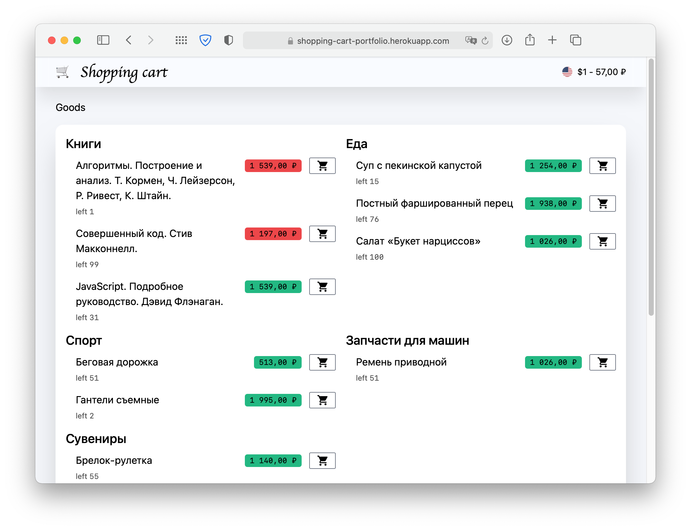

## 🛒 Shopping cart

📖 [Terms of reference](https://github.com/reslear/portfolio/tree/master/apps/shopping-cart/tor) | 📦 [Source](https://github.com/reslear/portfolio/tree/master/apps/shopping-cart) | 🚀 [Demo](https://shopping-cart-portfolio.herokuapp.com)

Catalog products with categories and subcategories,
with shopping cart functionality and live change currency support

### Stack:

- nuxt (vue 2)
- express
- typescript

### Plugins

- @nuxt/typescript-build
- @nuxtjs/axios
- @nuxtjs/composition-api
- typed-vuex
- windicss

### TODO

- [x] api server
- [x] get actual currency
- [x] show catalog
- [x] cart functionality
  - [x] store CRUD
  - [x] save to localstorage
  - [x] two-binding change amount
  - [x] sync with data
  - [x] total price
- [ ] refactor backend names
- [ ] interval price updating
- [x] deploy
